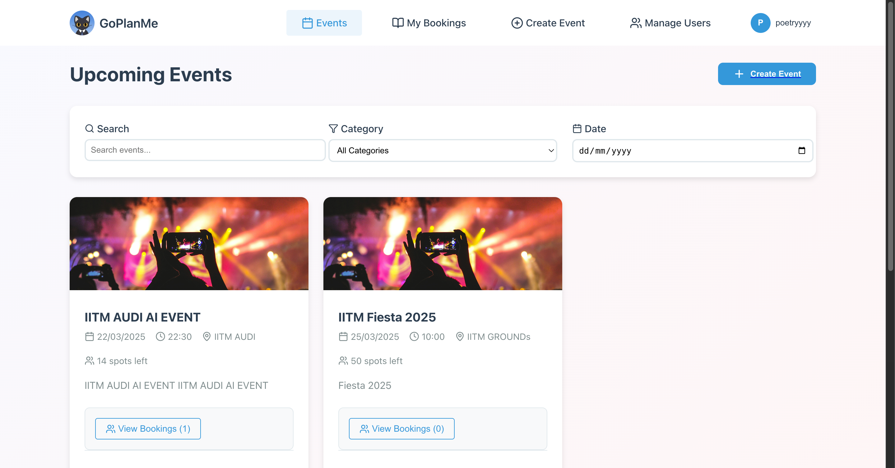

# Event Management System 🎉

A comprehensive full-stack event management platform built with React and Node.js. This system allows users to create, book, and manage events while providing administrative controls for event oversight.


## Features 🌟

### User Features
- 👤 User authentication (Register/Login)
- 📅 Browse and book events
- 🎫 View booked events history
- ✏️ Edit user profile
- 📞 Contact page for support
- 📝 Provide feedback

### Admin Features
- ✨ Create and manage events
- 👥 User management
- 📊 View all bookings
- 🔒 Protected admin routes

## Tech Stack 💻

### Frontend
- React.js
- CSS3 for styling
- React Router for navigation
- Protected Routes implementation

### Backend
- Node.js
- Express.js
- MongoDB (with Mongoose)
- JWT for authentication

## Installation & Setup 🚀

1. Clone the repository
```bash
git clone 
```

2. Install backend dependencies
```bash
cd backend
npm install
```

3. Configure environment variables
Create a `.env` file in the backend directory with:
```env
MONGODB_URI=your_mongodb_connection_string
JWT_SECRET=your_jwt_secret
PORT=3001
```

4. Install frontend dependencies
```bash
cd frontend
npm install
```

5. Run the application
```bash
# Start backend server (from backend directory)
npm start

# Start frontend development server (from frontend directory)
npm start
```

The application will be available at `http://localhost:3000`

## Project Structure 📁

```
├── backend/
│   ├── controller/
│   ├── model/
│   └── index.js
├── eventapp/
│   ├── public/
│   └── src/
│       ├── components/
│       │   ├── Event/
│       │   ├── Home/
│       │   ├── Login/
│       │   ├── Navbar/
│       │   └── UserProfile/
│       └── App.js
```

## Screenshots 📸

### Home Page


### Events


### Booked Events


## Contributing 🤝

1. Fork the repository
2. Create your feature branch (`git checkout -b feature/AmazingFeature`)
3. Commit your changes (`git commit -m 'Add some AmazingFeature'`)
4. Push to the branch (`git push origin feature/AmazingFeature`)
5. Open a Pull Request